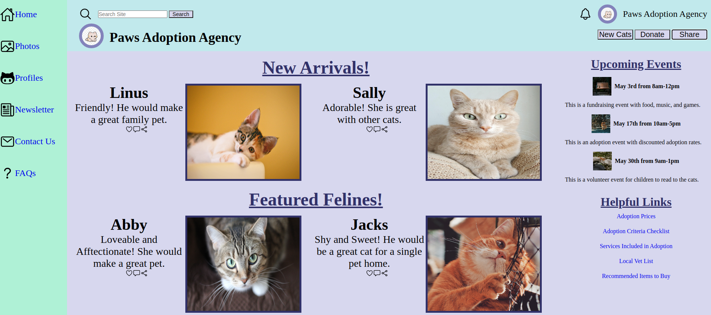

# Admin-Dashboard

**Obective:**

I created an admin dashboard using HTML, CSS, and jQuery. 

***Completed Dashboard Image***

***Features***

1. The dashboard bar has six icon links that are set up to be routed to other pages. The dashboard bar toggles shown and hidden for the six icon links using jQuery.
2. The header has a search bar and buttons to help you navigate the website. 
3. The page has an events section that can be updated regulary.
4. It also has a helpful links section that is ready to be routed to the pages listed.
5. There is a section for new and featured items in the body of the page also.

***Credits***
1. All icons were found on ionicons. https://ionic.io/ionicons
2. The cat logo was found on pngtree. https://pngtree.com/free-png-vectors/cat-icon 
3. The cat profile pictures were found on pexels. https://www.pexels.com/search/cat/

